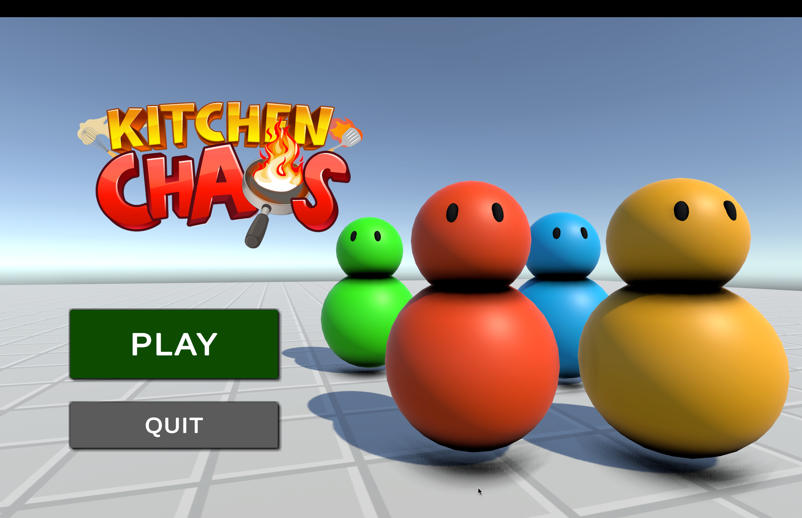
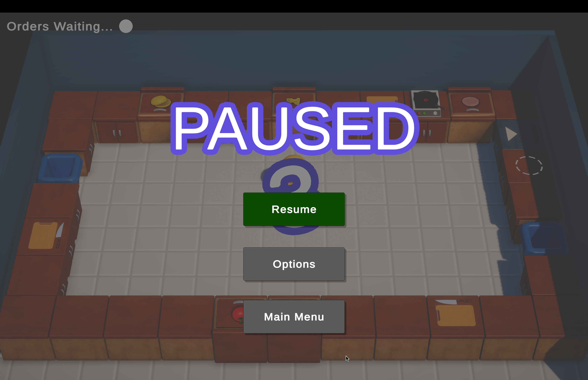
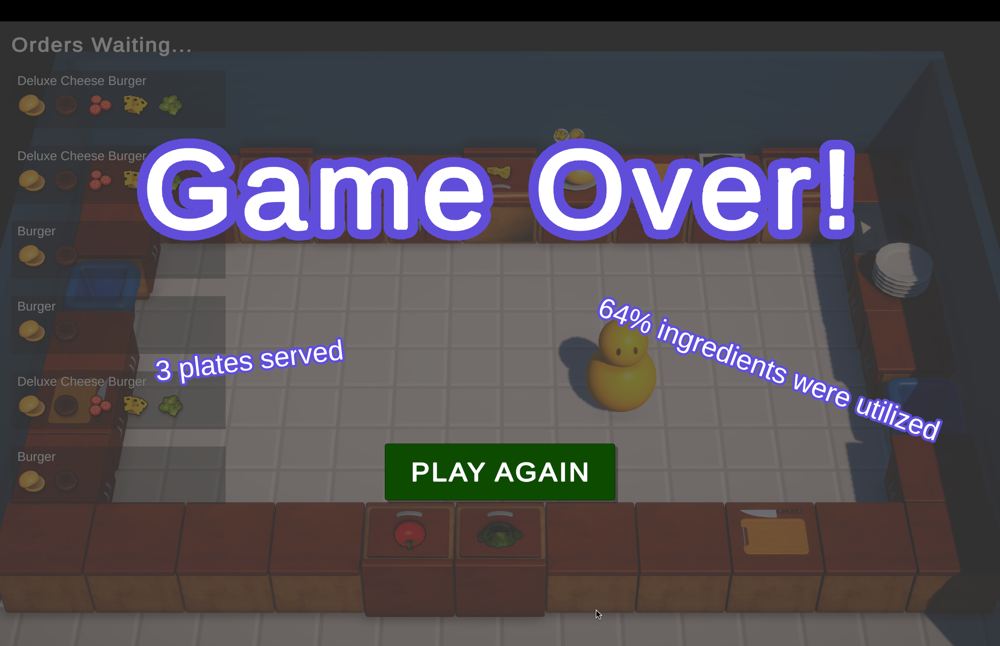

# CodeMonkey Kitchen Chaos

A cooking simulation game built with Unity3d. Following this great [free tutorial from CodeMonkey](https://unitycodemonkey.com/kitchenchaoscourse.php).

What I learned:
- Importance of writing clean code, and refactoring.
- The new InputSystem of unity.
- Decoupling with C# event.
- The power of ScriptableObject.
- How to use coroutine and state machine.
- Animation with AnimationController.
- Introduction to Shader Graph.
- And much more...

#### Gameplay ScreenShots

